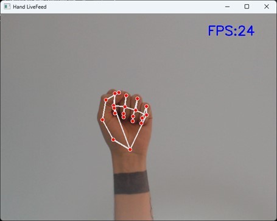
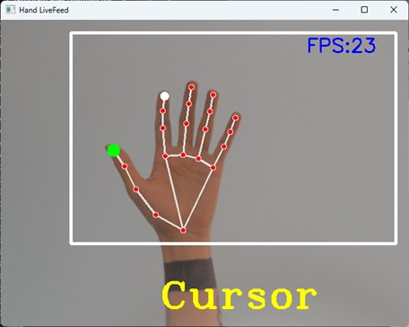
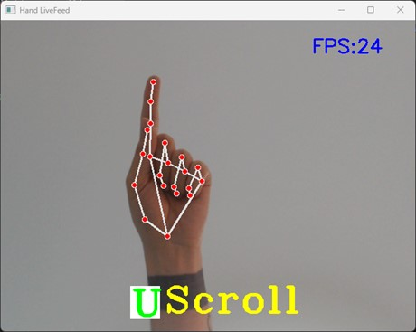
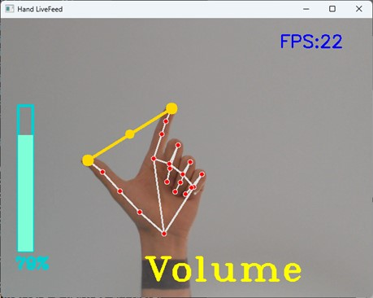

# Hand Gesture Control using Computer Vision and Mediapipe

This project implements hand gesture recognition and control using MediaPipe's hand tracking solution. It allows users to control their system's volume, scroll through web pages, and move the cursor using hand gestures captured via a webcam.

## Project Information

This project was completed on 23.06.2023 and was my graduation project for my Computer Engineering major.

## Features

- **Hand Detection and Tracking**: Uses MediaPipe's hand tracking solution to detect and track hand landmarks.
- **Volume Control**: Adjust the system volume by moving your thumb and index finger.
- **Scrolling**: Scroll up and down using specific finger gestures.
- **Cursor Movement**: Control the mouse cursor with hand movements.

## Examples






## Installation
### Setup

1. Clone the repository:
    ```bash
    git clone https://github.com/your-username/hand-gesture-control.git
    cd hand-gesture-control
    ```

2. Install the required packages:
    ```bash
    pip install -r requirements.txt
    ```

3. Run the main script:
    ```bash
    python Main.py
    ```

## Usage

### HandTrackingModule.py

This module contains the `handDetector` class which is used to detect hands and hand landmarks.

#### Class: `handDetector`

- **`__init__(self, static_image_mode=False, max_num_hands=2, model_complexity=1, min_detection_confidence=0.5, min_tracking_confidence=0.5)`**:
    - Parameters:
        - `static_image_mode`: Whether to treat input images as static.
        - `max_num_hands`: Maximum number of hands to detect.
        - `model_complexity`: Complexity of the hand tracking model.
        - `min_detection_confidence`: Minimum confidence for hand detection.
        - `min_tracking_confidence`: Minimum confidence for hand tracking.

- **`findHands(self, img, draw=True)`**:
    - Detects hands in the image and optionally draws the landmarks.
    - Parameters:
        - `img`: The input image.
        - `draw`: Whether to draw landmarks on the image.
    - Returns:
        - The image with landmarks drawn.

- **`findPosition(self, img, handNo=0, draw=True, color=(255, 0, 255), z_axis=False)`**:
    - Finds the positions of hand landmarks.
    - Parameters:
        - `img`: The input image.
        - `handNo`: Index of the hand to detect.
        - `draw`: Whether to draw landmarks on the image.
        - `color`: Color for drawing landmarks.
        - `z_axis`: Whether to include z-axis coordinates.
    - Returns:
        - List of hand landmark positions.

### Main.py

This script initializes the hand detector and uses it to control volume, scrolling, and cursor based on hand gestures.

#### Key Components

- **Camera Setup**:
    ```python
    wCam, hCam = 640, 480
    cap = cv2.VideoCapture(0)
    cap.set(3, wCam)
    cap.set(4, hCam)
    ```

- **Hand Detector Initialization**:
    ```python
    detector = hTm.handDetector(max_num_hands=1, min_detection_confidence=0.85, min_tracking_confidence=0.8)
    ```

- **Volume Control**:
    ```python
    devices = AudioUtilities.GetSpeakers()
    interface = devices.Activate(IAudioEndpointVolume._iid_, CLSCTX_ALL, None)
    volume = cast(interface, POINTER(IAudioEndpointVolume))
    volRange = volume.GetVolumeRange()
    ```

- **Main Loop**:
    Processes each frame to detect hand landmarks and perform actions based on detected gestures.

## Contributing

1. Fork the repository.
2. Create a new branch: `git checkout -b feature-branch`
3. Make your changes and commit them: `git commit -m 'Add some feature'`
4. Push to the branch: `git push origin feature-branch`
5. Open a pull request.

## License

This project is licensed under the MIT License - see the [LICENSE](LICENSE) file for details.

## Acknowledgements

- [MediaPipe](https://mediapipe.dev/)
- [OpenCV](https://opencv.org/)
- [PyAutoGUI](https://pyautogui.readthedocs.io/)
- [Pycaw](https://github.com/AndreMiras/pycaw)
